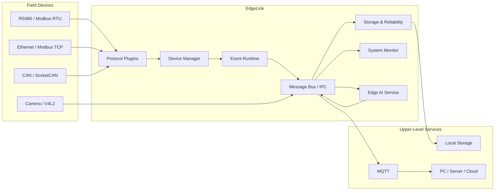

# EdgeLink

> **工业边缘网关与设备中间件**

EdgeLink 是一套面向 **RK3568 / ARM64 Linux** 的轻量级工业边缘网关与设备中间件，负责连接现场设备、统一设备数据、管理设备状态，并为上层应用提供可靠的数据传输与边缘服务能力。

项目重点关注 **Linux 系统编程、事件驱动通信、插件化设备接入、消息中间件、数据可靠性与系统可恢复性**，并预留 RK3568 NPU 边缘 AI 扩展能力。

---

## Architecture



EdgeLink 位于现场设备与上层应用之间。

南向负责接入不同类型的工业设备，北向负责向服务器、上位机或其他边缘服务提供统一的数据接口。

---

## Features

### Industrial Device Connectivity

面向异构工业设备提供统一接入能力，计划支持：

- Modbus RTU
- Modbus TCP
- SocketCAN
- UART / RS485
- Ethernet

不同协议通过独立 Plugin 接入 EdgeLink Core，避免协议实现与核心运行逻辑强耦合。

---

### Plugin-Based Architecture

EdgeLink 使用插件化架构扩展设备协议。

```text
                 EdgeLink Core
                       │
                Plugin Manager
                       │
          ┌────────────┼────────────┐
          │            │            │
       Modbus         CAN          Mock
       Plugin        Plugin        Plugin
```

协议模块以动态链接库形式加载，为后续扩展新的设备类型和工业协议提供统一接口。

涉及的 Linux 机制包括：

- Shared Library
- `dlopen`
- `dlsym`
- Plugin Lifecycle
- Interface / ABI

---

### Event-Driven Runtime

核心 I/O 采用 Linux 事件驱动模型。

```text
                   EventLoop
                       │
                     epoll
            ┌──────────┼──────────┐
            │          │          │
          Socket     timerfd    eventfd
```

主要用于处理：

- Network I/O
- Device Events
- Timers
- Cross-Thread Wakeup
- Task Scheduling

相比大量阻塞线程或 `while + sleep` 轮询，事件驱动架构能够更好地控制线程数量和系统资源占用。

---

### Unified Device Model

EdgeLink 对不同工业协议下的设备进行统一抽象。

```text
Device
 ├── Device ID
 ├── Protocol
 ├── Connection State
 │
 └── Tags
      ├── Value
      ├── Data Type
      ├── Timestamp
      └── Quality
```

上层服务无需直接关心设备底层使用的是 Modbus、CAN 或其他通信方式。

典型数据质量状态包括：

```text
GOOD
STALE
TIMEOUT
INVALID
DISCONNECTED
```

---

### Message Bus & IPC

EdgeLink 使用 Publish / Subscribe 模型解耦内部模块。

```text
                    Device Service
                          │
                       publish
                          │
                          ▼
                    Message Bus
             ┌────────────┼────────────┐
             │            │            │
           MQTT        Storage      Monitor
```

后续支持跨进程通信：

- Unix Domain Socket
- Shared Memory
- `mmap`
- `eventfd`

为 Camera、AI、Device Service 等独立服务提供低耦合通信机制。

---

### Reliable Data Pipeline

工业现场可能随时发生网络中断、设备掉线或服务异常。

EdgeLink 将提供：

- Device Timeout Detection
- Automatic Reconnect
- Exponential Backoff
- Connection State Machine
- Local Persistent Buffer
- Store-and-Forward
- Process Recovery

典型数据链路：

```text
Device Data
     │
     ▼
 Message Bus
     │
     ▼
 MQTT Online?
    /        \
  Yes        No
   │          │
   ▼          ▼
 Publish    SQLite
              │
              ▼
        Network Restored
              │
              ▼
          Data Replay
```

---

### Device Lifecycle Management

EdgeLink 持续维护设备连接状态。

```text
INIT
  │
  ▼
CONNECTING
  │
  ▼
CONNECTED
  │
  ├──────────────┐
  │              │ Timeout
  │              ▼
  │        DISCONNECTED
  │              │
  │              ▼
  │           BACKOFF
  │              │
  │              ▼
  └──────── RECONNECTING
```

设备异常不会直接导致整个系统停止工作。

---

### System Monitoring

EdgeLink 将直接读取 Linux 系统接口：

```text
/proc
/sys
```

监控：

- CPU Usage
- Memory Usage
- Load Average
- System Uptime
- CPU Temperature
- Network Statistics
- Process Status
- Device Status

系统运行信息将用于日志、故障定位和性能测试。

---

### Edge AI Extension

Edge AI 是 EdgeLink 的扩展能力，而不是核心运行时的替代品。

RK3568 上计划构建：

```text
USB Camera
     │
     ▼
    V4L2
     │
     ▼
Camera Service
     │
     ▼
Shared Memory
     │
     ▼
 AI Service
     │
     ▼
RKNN Runtime
     │
     ▼
 RK3568 NPU
     │
     ▼
Detection Result
     │
     ▼
 Message Bus
```

AI 推理结果可以进一步触发：

- Alarm
- MQTT Upload
- Local Storage
- Device Event

---

## Core Components

| Component | Description |
|---|---|
| **EventLoop** | 基于 `epoll` 的 Linux 异步事件运行核心 |
| **ThreadPool** | 执行不能阻塞 EventLoop 的后台任务 |
| **Plugin Manager** | 动态加载和管理设备协议插件 |
| **Device Manager** | 管理设备、Tag、连接状态和生命周期 |
| **Scheduler** | 管理设备采集与周期性任务 |
| **Message Bus** | 提供进程内 Publish / Subscribe |
| **IPC** | 提供跨进程数据与事件通信 |
| **Storage Service** | 本地持久化与 Store-and-Forward |
| **MQTT Service** | EdgeLink 与上层服务器之间的数据通信 |
| **System Monitor** | Linux 系统资源与运行状态监控 |
| **Edge AI Service** | RK3568 NPU 边缘视觉推理扩展 |

---

## Tech Stack

### Core

- C++17
- Linux
- CMake
- Git

### Linux System Programming

- `epoll`
- `timerfd`
- `eventfd`
- Socket
- TCP/IP
- Unix Domain Socket
- Shared Memory
- `mmap`
- Signal
- `dlopen`
- `dlsym`
- `/proc`
- `/sys`

### Concurrency

- `std::thread`
- Mutex
- Condition Variable
- Thread Pool
- RAII
- Smart Pointer

### Industrial Connectivity

- UART
- RS485
- Modbus RTU
- Modbus TCP
- CAN
- SocketCAN
- MQTT

### Data & Configuration

- SQLite3
- WAL
- JSON
- YAML

### Debugging & Profiling

- GDB
- Core Dump
- strace
- AddressSanitizer
- UBSan
- Valgrind
- perf

### Edge AI

- V4L2
- RKNN Runtime
- RK3568 NPU

---

## Third-Party Libraries

EdgeLink 不重复实现成熟的标准协议栈，而将主要精力放在系统运行时、中间件架构和可靠性机制上。

| Function | Library |
|---|---|
| Modbus | libmodbus |
| MQTT | Eclipse Paho |
| Database | SQLite3 |
| JSON | nlohmann/json |
| YAML | yaml-cpp |
| Unit Test | GoogleTest |
| Edge AI | RKNN Runtime / Toolkit |

---

## Project Structure

```text
EdgeLink/
│
├── apps/
│   ├── edgelinkd/
│   └── edgelink-cli/
│
├── include/
│   └── edgelink/
│
├── core/
│   ├── event/
│   ├── thread/
│   ├── message/
│   ├── ipc/
│   ├── plugin/
│   ├── device/
│   └── scheduler/
│
├── plugins/
│   ├── mock/
│   ├── modbus/
│   └── can/
│
├── services/
│   ├── mqtt/
│   ├── storage/
│   ├── monitor/
│   └── ai/
│
├── drivers/
│
├── config/
│
├── tests/
│   ├── unit/
│   ├── integration/
│   ├── benchmark/
│   └── fault/
│
├── scripts/
│
├── docs/
│   ├── architecture/
│   ├── benchmark/
│   └── deployment/
│
├── cmake/
│
├── CMakeLists.txt
├── .gitignore
├── LICENSE
└── README.md
```

---

## Reliability & Testing

EdgeLink 不以“功能能够运行”作为最终完成标准，而会主动验证系统在异常场景下的行为。

计划测试：

### Device Failure

```text
CONNECTED
    │
    ▼
 TIMEOUT
    │
    ▼
DISCONNECTED
    │
    ▼
 BACKOFF
    │
    ▼
RECONNECTING
```

### Network Failure

断开 RK3568 网络后验证：

- MQTT 自动检测掉线
- 数据进入本地缓存
- 网络恢复后自动重新连接
- 缓存数据自动补传

### Process Failure

主动执行：

```bash
kill -9 edgelinkd
```

验证 systemd / watchdog 自动恢复。

### Performance Test

最终测试场景计划达到：

- 20 个模拟设备
- 1000 Tags
- 100 ms / 500 ms Polling
- 24 h 稳定运行
- 目标 72 h 长稳测试

重点记录：

- CPU Usage
- Memory Usage
- Throughput
- P50 Latency
- P95 Latency
- P99 Latency
- Data Loss
- Reconnect Time

---

## Roadmap

- [ ] Core project infrastructure
- [ ] ThreadPool & basic runtime
- [ ] `epoll` EventLoop
- [ ] `timerfd` / `eventfd`
- [ ] Plugin Manager
- [ ] Unified Device Model
- [ ] Message Bus
- [ ] IPC
- [ ] Modbus RTU / TCP
- [ ] SocketCAN
- [ ] Device Scheduler
- [ ] Connection State Machine
- [ ] MQTT Service
- [ ] SQLite persistence
- [ ] Store-and-Forward
- [ ] systemd & watchdog
- [ ] System Monitor
- [ ] Fault Injection
- [ ] Benchmark
- [ ] V4L2 Camera Service
- [ ] RKNN Edge AI Service

---

## Development Status

EdgeLink is currently under active development.

Current stage:

**Project Initialization**

Completed:

- [x] Project definition
- [x] System architecture
- [x] Technical roadmap
- [x] GitHub repository
- [x] Development environment planning

---

## Related Repository

### EdgeLink-Linux-Labs

EdgeLink 配套 Linux 系统编程实验仓库。

用于在正式集成进 EdgeLink 之前，通过独立的小型实验验证：

- Thread
- Socket
- epoll
- timerfd
- eventfd
- Unix Domain Socket
- Shared Memory
- mmap
- dlopen
- Linux IPC

整体开发方式：

```text
学习 Linux API
       │
       ▼
完成最小实验
       │
       ▼
理解运行机制
       │
       ▼
集成进 EdgeLink
```

---

## License

This project is licensed under the **MIT License**.
